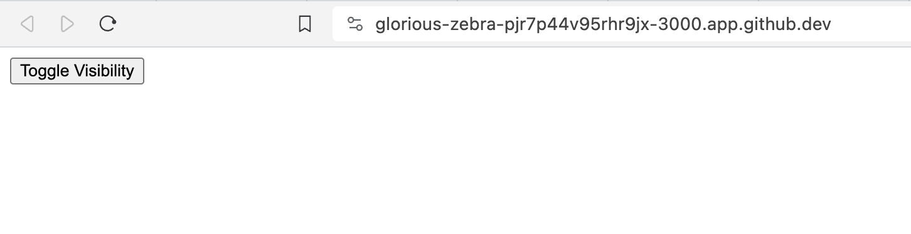
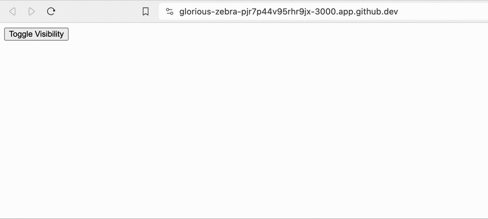

# Organizing JavaScript Code
In our previous lessons, we've seen how [JavaScript](https://learn.firstdraft.com/lessons/203-minimal-js) can enhance the interactivity of our Rails applications using [Ajax with Rails Unobtrusive JavaScript (UJS)](https://learn.firstdraft.com/lessons/204-rails-unobtrusive-ajax). Building on this foundation, we're now set to delve deeper into the organization of JavaScript code and three distinct approaches to managing JavaScript in a Rails environment. To bring these concepts to life, we'll implement a practical example, implementing interactive features in a Ruby on Rails application using both Vanilla JavaScript, Stimulus.js, and React.

## Evolution of JavaScript in Rails
JavaScript's integration in Rails has evolved significantly, adapting to the changing landscape of web development. Let's explore this evolution and its implications on how we manage JavaScript in a Rails application today.

### Early Days: Inline JavaScript
Initially, JavaScript in Rails was often embedded directly within HTML using `<script>` tags. This approach is straightforward but quickly becomes unmanageable as applications grow in complexity.

```html
<!DOCTYPE html>
<html>
  <body>
    <h2>JavaScript Alert</h2>
    <button onclick="myAlertFunction()">Click me</button>
    <script>
      function myAlertFunction() {
        alert("Hello, world!");
      }
    </script>
  </body>
</html>
```

### The Asset Pipeline Era
With Rails 3.1, the [Asset Pipeline](https://guides.rubyonrails.org/asset_pipeline.html) was introduced, addressing the challenges of managing JavaScript. It provides a structured approach to bundling, concatenating, and minifying JavaScript files.

#### Bundling and Concatenation
The [Asset Pipeline](https://guides.rubyonrails.org/asset_pipeline.html) combines multiple JavaScript files into a single file, reducing HTTP requests and improving load times.

#### Caching and Cache-Busting
The [Asset Pipeline](https://guides.rubyonrails.org/asset_pipeline.html) also implementes caching strategies. A unique fingerprint is added to file names ensuring users always receive the most updated version. The rendered HTML of the deployed site translates to something like this:

```html
<script src="/assets/application-abcdef1234567890.js"></script>
```
The rendered html version includes a fingerprint "abcdef1234567890". This fingerprint is a hash generated based on the file's content for cache-busting purposes.

#### Minification
The [Asset Pipeline](https://guides.rubyonrails.org/asset_pipeline.html) implements a technique called **minification** to remove unnecessary characters from JavaScript files (spaces, line breaks, etc.), reducing file size and speed up page loads.

<aside>
  There is a convention to add a `min` suffix to minified files. (eg `filename.min.js`)
</aside>

#### Directory Structure and Sprockets
The [Asset Pipeline](https://guides.rubyonrails.org/asset_pipeline.html) standardizes the organization of these assets in `app/assets/`. 

```
app/
  assets/
    config/
      manifest.js
    images/
    stylesheets/
```

[Sprockets](https://github.com/rails/sprockets), a key component of the Pipeline, handles the concatenation and compression of assets. Projects using the [Asset Pipeline](https://guides.rubyonrails.org/asset_pipeline.html) will have the `sprockets-rails` gem in the `Gemfile`. There is a manifest file at `app/assets/config/manifest.js` that indexes all the assets you want to concatenate and minify. `//=` directives are used in `app/assets/config/manifest.js` to include images, stylesheets, and javascript.

```javascript
// app/assets/config/manifest.js

//= link_tree ../images
//= link_directory ../stylesheets .css
//= link_tree ../../javascript .js
```

Typically, JavaScript files in Rails are placed under `app/javascript`. As your application grows, keeping your javascript code in this directory with a clear structure keeps your codebase manageable. Clear organization also helps team members (and instructors 🥹) to understand and contribute to the codebase effectively. Here’s a typical structure:

```
app/
  javascript/
    channels/
    controllers/
    custom/
      your_custom_script.js
    application.js
```

- **Channels**: Used for [ActionCable](https://guides.rubyonrails.org/action_cable_overview.html) related files.
- **Controllers**: [Stimulus](https://github.com/hotwired/stimulus-rails) controllers are typically placed here. (more on this later)
- **Custom**: Create custom directories like `custom/` or `util/` for your specific scripts.
- **application.js**: The JavaScript manifest file. You can think of it as a central directory or index of your JavaScript files.

#### Limitations 
Despite its benefits, the Asset Pipeline has limitations, especially in managing JavaScript dependencies and modern JavaScript tooling.

<aside>
  Adding external JavaScript dependencies in a Rails application using the Asset Pipeline (before Rails 7) involved a few more manual steps. The process typically included:

  1. The `vendor/assets/javascripts` directory was used to store external JavaScript libraries or frameworks.

  2. Developers had to manually download the JavaScript file (e.g., a jQuery plugin) or copy it from a source and place it into the `vendor/assets/javascripts` directory. This process was not automated and required manual updating for each new version of the library.

  3. `app/assets/config/manifest.js` was used to include the external library using [Sprockets](https://github.com/rails/sprockets) directives.

  ```
    //= require jquery
    //= require bootstrap
  ```
</aside>


### Webpacker
This led to the introduction of [Webpacker](https://github.com/rails/webpacker) in Rails 5, allowing the integration of modern JavaScript frameworks (like [React](https://react.dev/) or [Vue](https://vuejs.org/)), tools like [Babel](https://babeljs.io/) for transpiling and [npm](https://www.npmjs.com/) for managing third party libraries.

<aside>
  [Babel](https://babeljs.io/) is a JavaScript transpiler that is used to convert ES6 code into backwards-compatible JavaScript code that can be run by older JavaScript engines. It allows web developers to take advantage of the newest features of JavaScript while still supporting older browsers like Internet Explorer.
</aside>

<aside>
  **ES6** (also known as ECMAScript 6) is a recent update to the JavaScript programming language. ES6 modules allow you to break your JavaScript into smaller, reusable components. One approach to organize JavaScript in your project is to create separate modules in the `javascript/` directory. Then, export functions, objects, or classes from these modules and import them in `app/javascript/application.js` or any other module where you need them.

  Example:

  ```javascript
    // app/custom/hello.js
    export function sayHello(name) {
      return `Hello, ${name}!`;
    }

    // app/javascript/application.js
    import { sayHello } from './custom/hello';

    console.log(sayHello('Alice'));
  ```
</aside>

### Import Maps
[Import Maps](https://github.com/rails/importmap-rails) in Rails 7 addresses some of the Asset Pipeline's limitations by simplifying the inclusion of JavaScript dependencies. It leverages modern browser capabilities to load JavaScript modules directly from the browser at runtime (loading them from a CDN), without the need for compilation or bundling. 

<aside>
  **CDNs** (or Content Delivery Networks) store copies of web content on multiple servers across different geographical locations. When a user accesses a web page, the CDN delivers content from the server closest to them, reducing load times.
</aside>

## Practical Example: Toggling Text Visibility
We'll implement a feature where users can toggle the visibility of a paragraph of text on a webpage. We'll implement this same feature using 5 distinct approaches.

1. "Vanilla" JavaScript
2. The Asset Pipeline with Import Maps
3. Stimulus.js
4. Alternative Bundling with jsbundling-rails, esbuild, and React
5. API-only

Let's start by creating a new repository using the [Rails 7 template](https://github.com/new?template_name=rails-7-template&template_owner=appdev-projects) and name it something like "toggle-text-example" and then open it up in a codespace.

### Example 1: "Vanilla" JavaScript
<aside>
  "Vanilla" JavaScript means using plain JavaScript without any additional libraries like jQuery.
</aside>

Let's create a `PagesController` with a `home` action and view then set that action to the root route.

```ruby
# app/controllers/pages_controller.rb
class PagesController < ApplicationController

  def home; end

end
```

```ruby
# config/routes.rb
Rails.application.routes.draw do
  root "pages#home"
end
```

Create a `home` view and include an `onclick` handler in the `<button>` and a `.hidden` css class:

```html
<!-- app/views/pages/home.html.erb -->

<style>
  .hidden {
    display: none;
  }
</style>

<p id="my-hidden-text" class="hidden">
  This is hidden text.
</p>

<button>Toggle Visibility</button>
```

If we run `rails server` in the terminal and visit our root route we should see our button.




However, when we click the button, nothing happens. Now we need to add javascript functionality to this button. Define the `toggleTextVisibility` function in a `<script>` tag within the HTML file. Using the `onclick` attribute, we can directly attach a click event handler to the button in our HTML. 

```html
<!-- app/views/pages/home.html.erb -->

<style>
  .hidden {
    display: none;
  }
</style>

<p id="my-hidden-text" class="hidden">
  This is hidden text.
</p>

<!-- toggleTextVisibility() will be called when we click the button -->
<button onclick="toggleTextVisibility()">Toggle Visibility</button>

<script>
  function toggleTextVisibility() {
    const text = document.getElementById('my-hidden-text');
    text.classList.toggle('hidden');
  }
</script>
```

In this code, the `toggleTextVisibility` function will be called when the button is clicked.



Now that this is working, let's refactor our code a bit for better organization. Make sure you have `<%= stylesheet_link_tag "application", "data-turbo-track": "reload" %>` in `app/views/layouts/application.html.erb` so it is compiled through the asset pipeline.

```erb
<!-- app/views/layouts/application.html.erb -->
<!DOCTYPE html>
<html>
  <head>
    ...
    <%= stylesheet_link_tag "application", "data-turbo-track": "reload" %>
    ...
  </head>

  <body>
    <%= yield %>
  </body>
</html>
```

Which renders to something like this.

```html
<!DOCTYPE html>
<html>
  <head>
    ...
    <link rel="stylesheet" href="/assets/application-666b940ccd89946066e3be0d5db5822ee6678c304a9a3a4b5c5c2fecbf54093b.css" data-turbo-track="reload" />
    ...
  </head>

  <body>
    ...
  </body>
</html>
```

Now we can move the CSS rule for `.hidden` to `app/assets/stylesheets/application.css` and it will be globally available in our application.

```css
/* app/assets/stylesheets/application.css */

.hidden {
  display: none;
}
```

When we remove the `<style>` tag from your `app/views/pages/home.html.erb` view it should look like this.

```html
<!-- app/views/pages/home.html.erb -->

<p id="my-hidden-text" class="hidden">
  This is hidden text.
</p>

<!-- toggleTextVisibility() will be called when we click the button -->
<button onclick="toggleTextVisibility()">Toggle Visibility</button>

<script>
  function toggleTextVisibility() {
    const text = document.getElementById('my-hidden-text');
    text.classList.toggle('hidden');
  }
</script>
```

### Example 2: The Asset Pipeline with Import Maps
Now let's take advantage of the [Asset Pipeline](https://guides.rubyonrails.org/asset_pipeline.html) with [Import Maps](https://github.com/rails/importmap-rails) to refactor our JavaScript using ES6 style imports.

Ensure the `importmap-rails` gem is in your `Gemfile` (it's included/installed by default in Rails 7).

```ruby
# Gemfile
gem 'importmap-rails'
```

Then run the install script.

```bash
$ bundle install
$ bin/rails importmap:install
```

This will create a `config/importmap.rb` file that will "pin" your `app/javascript/application.js` to the import map.

```ruby
# Pin npm packages by running ./bin/importmap

pin "application", preload: true
```

Ensure your layout file includes the `javascript_importmap_tags` in the `<head>`. It should look something like this.

```erb
<!-- app/views/layouts/application.html.erb -->
<!DOCTYPE html>
<html>
  <head>
    ...
    <%= javascript_importmap_tags %>
    ...
  </head>

  <body>
    <%= yield %>
  </body>
</html>
```

Now if you visit the root route of your application it will import your `application.js` in the head using a`<script type="importmap">` tag in the rendered html.

```erb
<!DOCTYPE html>
<html>
  <head>
    <!-- other head elements -->
    <script type="importmap" data-turbo-track="reload">{
      "imports": {
        "application": "/assets/application-3897b39d0f7fe7e947af9b84a1e1304bb30eb1dadb983104797d0a5e26a08736.js"
      }
    }</script>
    <link rel="modulepreload" href="/assets/application-3897b39d0f7fe7e947af9b84a1e1304bb30eb1dadb983104797d0a5e26a08736.js">
    <script src="/assets/es-module-shims.min-d89e73202ec09dede55fb74115af9c5f9f2bb965433de1c2446e1faa6dac2470.js" async="async" data-turbo-track="reload"></script>
    <script type="module">import "application"</script>
  </head>

  <body>
    <!-- your html body -->
  </body>
</html>
```

<aside>
`es-module-shims.min.js` is a JavaScript library that provides shim (or polyfill) support for ES6 modules in browsers that do not fully support ES6 module syntax natively.
</aside>

This will allow us to use ES6 style imports in our application. Let's refactor that `toggleTextVisibility` function we wrote into it's own file and import it in the `app/javascript/application.js` file. Create a file for the function.

```javascript
// app/javascript/custom/toggle_visibility.js
export function toggleTextVisibility() {
  const text = document.getElementById('my-hidden-text');
  text.classList.toggle('hidden');
}
```
Then import this function in `application.js` and attach to the `window` so we can access it in the view.

```javascript
import { toggleTextVisibility } from "./custom/toggle_visibility";

document.addEventListener('DOMContentLoaded', () => {
  // attach it to window
  window.toggleTextVisibility = toggleTextVisibility;
});
```

Now we can remove the `<script>` tag from our view.

```html
<!-- app/views/pages/home.html.erb -->
<p id="my-hidden-text" class="hidden">
  This is hidden text.
</p>

<button onclick="toggleTextVisibility()">Toggle Visibility</button>
```

### Example 3: Stimulus.js
Instead of directly attaching event handlers in your HTML (like `onclick` attributes) or globally exposing functions (like how we attached the function to the window during the `DOMContentLoaded` event), [Stimulus.js](https://stimulus.hotwired.dev/) enhances HTML by connecting elements to JavaScript objects via data attributes, making the code more organized and maintainable. Let's refactor our toggle visibility functionality using [Stimulus.js](https://stimulus.hotwired.dev/).

#### Step 1: Setting Up Stimulus

Run the command to install Stimulus.

Add the `stimulus-rails` gem to your `Gemfile`. 
```ruby
# Gemfile
gem 'stimulus-rails'
```

And then install Stimulus.

```bash
$ bundle install
$ rails stimulus:install
```

This will add some boilerplate code for using Stimulus controllers in your application. Importantly, it will `pin` Stimulus JavaScript code to your importmap.

```ruby
# config/importmap.rb
pin "@hotwired/stimulus", to: "stimulus.min.js", preload: true
pin "@hotwired/stimulus-loading", to: "stimulus-loading.js", preload: true
pin_all_from "app/javascript/controllers", under: "controllers"
```

If you inspect your `<head>` you'll now be importing Stimulus library (and controllers) in your application.

```html
<script type="importmap" data-turbo-track="reload">{
  "imports": {
    "application": "/assets/application-f9bcf6a93fe3cb044701030ec651bacc701aa3cc37bd995c3f9d0f5f862785a8.js",
    "@hotwired/stimulus": "/assets/stimulus.min-d03cf1dff41d6c5698ec2c5d6a501615a7a33754dbeef8d1edd31c928d17c652.js",
    "@hotwired/stimulus-loading": "/assets/stimulus-loading-1fc59770fb1654500044afd3f5f6d7d00800e5be36746d55b94a2963a7a228aa.js",
    "controllers/application": "/assets/controllers/application-368d98631bccbf2349e0d4f8269afb3fe9625118341966de054759d96ea86c7e.js",
    "controllers/hello_controller": "/assets/controllers/hello_controller-549135e8e7c683a538c3d6d517339ba470fcfb79d62f738a0a089ba41851a554.js",
    "controllers": "/assets/controllers/index-2db729dddcc5b979110e98de4b6720f83f91a123172e87281d5a58410fc43806.js"
  }
}
</script>
```

Let's create a new Stimulus controller for our toggle hidden functionality. We can call this controller `toggle_hidden`.

```bash
$ rails generate stimulus toggle_hidden
```

This command will create a Stimulus controller.

```javascript
// app/javascript/controllers/toggle_hidden_controller.js

import { Controller } from "@hotwired/stimulus"

// Connects to data-controller="toggle-hidden"
export default class extends Controller {
  connect() {
  }
}
```

Let's edit this controller to include our `toggle` functionality and adjust our view to connect this controller using `data-attributes`.

```javascript
// app/javascript/controllers/toggle_hidden_controller.js

// imports the Controller class from the Stimulus library.
import { Controller } from "@hotwired/stimulus"

// creates a new Stimulus controller class extending the base Controller class from Stimulus
export default class extends Controller {
  // declare a target named "text". This lets us refer to DOM elements marked with data-toggle-hidden-target="text".
  static targets = ["text"]

  // gets called when a data-action occurs
  toggle() {
    // accessing the "text" target and toggling its hidden class.
    this.textTarget.classList.toggle('hidden');
  }
}
```

```erb
<!-- app/views/pages/home.html.erb -->

<!-- connects this div (and its contents) to the app/javascript/controllers/toggle_hidden_controller.js Stimulus controller. -->
<div data-controller="toggle-hidden">

  <!-- connects this p to the 'text' target defined in the JavaScript controller -->
  <p data-toggle-hidden-target="text" class="hidden">
    This is hidden text.
  </p>

  <!-- clicking this button will execute the toggle method in the toggle_hidden.js controller -->
  <button data-action="click->toggle-hidden#toggle">Toggle Visibility</button>
</div>

```

We can now remove the "Vanilla" JavaScript code we wrote and safely delete the `app/javascript/custom` directory and the `toggle_visibility.js` file we wrote earlier. Our `application.js` file should now look like this, simply importing our Stimulus controllers.

```javascript
// app/javascript/application.js

// This is available because we called `pin_all_from "app/javascript/controllers", under: "controllers"` in the importmap.rb
import "controllers"
```

<!-- TODO: talk about importmap `pinning` more? -->

Run your Rails server and the toggle visibility button should work exactly as before.

<!-- TODO: verify this works as expected -->
### Example 4: Alternative Bundling with jsbundling-rails, esbuild, and React
For more complex JavaScript setups like integrating [React](https://react.dev/), [TypeScript](), or other transpiling dependent technologies; Rails 7 offers tools like `jsbundling-rails`. Let's rebuild our `toggle_hidden.js` Stimulus controller into a React component to demonstrate this alternative bundling approach.

Add the `jsbundling-rails` gem to your `Gemfile` and run `bundle install` in your terminal to install the gem.

```ruby
gem 'jsbundling-rails'
```

Then we'll install a bundler. For this example, we'll use esbuild. 

```sh
$ bin/rails javascript:install:esbuild
```

<aside>
  [esbuild](https://esbuild.github.io/) is a javascript application bundling tool. There are also other bundling libraries like [webpack](https://webpack.js.org/) that offer similar functionality.
</aside>

This will add a `javascript_include_tag` in the `application.html.erb` layout file. Make sure to remove `javascript_importmap_tags`, `config/importmap.rb`, "importmap-rails" gem, and our Stimulus controllers since we are no longer using Import Maps or Stimulus. Our application layout file should look like this.

```erb
<!-- app/views/layout/application.html.erb -->

<!DOCTYPE html>
<html>
  <head>
    <title>Rails Template</title>
    <meta name="viewport" content="width=device-width,initial-scale=1">
    <%= csrf_meta_tags %>
    <%= csp_meta_tag %>

    <%= stylesheet_link_tag "application", "data-turbo-track": "reload" %>
    <%= javascript_include_tag "application", "data-turbo-track": "reload", type: "module" %>
  </head>

  <body>
    <%= yield %>
  </body>
</html>
```

Which will render in our html like this.

```html
<!DOCTYPE html>
<html>
  <head>
    ...
    <script src="/assets/application-5bd6a815d7a412d9ceabf13a64dd6ab12e3d0f9fb68c9ec4605cf8dd5b75b754.js" data-turbo-track="reload" type="module"></script>
    ...
  </head>

  <body>
    ...
  </body>
</html>
```

Now that we've removed Import Maps and added esbuild, we'll use [npm](https://www.npmjs.com/) or [yarn](https://yarnpkg.com/) for bundling our javascript. You can manage your javascript dependencies in `package.json` (which is similar to a Gemfile for JavaScript packages). We'll use the "build" command to bundle our `application.js` file. 

```json
// package.json
{
  "name": "app",
  "private": true,
  "dependencies": {
    "esbuild": "^0.19.12"
  },
  "scripts": {
    "build": "esbuild app/javascript/*.* --bundle --sourcemap --format=esm --outdir=app/assets/builds --public-path=/assets --loader:.js=jsx"
  }
}
```

We can use `yarn build --watch` to automatically rebuild the javascript anytime you make changes. These builds will be added to the `app/assets/builds` folder. Make sure to remove the old javascript directives in the sprockets manifest.

```javascript
// app/assets/config/manifest.js

//= link_tree ../images
//= link_directory ../stylesheets .css
//= link_tree ../builds
```

Now let's add [React](https://react.dev/) using Yarn. 

```sh
yarn add react react-dom
```

This command will add `react` and `react-dom` to the `package.json`dependencies. Make sure to add `--loader:.js=jsx` to our `package.json` "build" script. This will allow us to build the .jsx files used in React.

Let's create a React component `app/javascript/components/ToggleVisibility.js`

```jsx
import React, { useState } from "react";

const ToggleVisibility = () => {
  const [isVisible, setIsVisible] = useState(false);

  const toggleVisibility = () => {
    setIsVisible(!isVisible);
  };

  return (
    <div>
      {isVisible && <p>This is hidden text.</p>}
      <button onClick={toggleVisibility}>
        Toggle Visibility
      </button>
    </div>
  );
};

export default ToggleVisibility;
```

Then in your `app/javascript/application.js`, import the React component.

```javascript
import * as React from "react";
import * as ReactDOM from "react-dom/client";
import ToggleVisibility from "./components/ToggleVisibility";

document.addEventListener('DOMContentLoaded', () => {
  const root = ReactDOM.createRoot(document.getElementById('home'));
  root.render(<ToggleVisibility />)
});
```

We'll also need to update our `home` view file to add an id for the React app to attach to.

```html
<!-- app/views/pages/home.html.erb -->

<div id="home" />
```

Start your Rails server in a terminal `bin/rails server` and your yarn build in another terminal `yarn build --watch`. Visit the home page and your React component should appear. It should work exactly as before, but now with `React` and `esbuild`.


### Example 5: API-only approach
Another common approach you will encounter is a totally decoupled backend and frontend. In an API-only application, Rails is used primarily as a backend service that provides an API (usually JSON). This API is consumed by a frontend application (like a React app). The React application handles the user interface and interacts with the API over HTTP.
This separation allows for more flexibility in development and deployment, and it can lead to better performance and scalability. However, it also adds more complexity in terms of setup, development, deployment and maintenance, as you are essentially managing two separate applications.

### Choosing the Right Approach
- Choose the "Vanilla" JavaScript approach if your application only requires a few "sprinkles" of JavaScript here and there.
- Choose the [Asset Pipeline](https://guides.rubyonrails.org/asset_pipeline.html) with [Import Maps](https://github.com/rails/importmap-rails) for less complex JavaScript integrations.
- Choose Alternative Bundling libraries like [jsbundling-rails](https://github.com/rails/jsbundling-rails) if your project requires integration with Single Page Application (SPA) frameworks like [React](https://react.dev/) or [Vue](https://vuejs.org/) or extensive JavaScript tooling like [NPM](https://www.npmjs.com/).
- Choose an API-only Rails backend with an SPA frontend if your project requires a high level of interactivity, has distinct frontend and backend development teams, or needs the flexibility to adapt to changing frontend technologies. 

## Resources
- [The Asset Pipeline](https://guides.rubyonrails.org/asset_pipeline.html)
- [Working with JavaScript in Rails](https://guides.rubyonrails.org/working_with_javascript_in_rails.html)
- [Stimulus.js](https://stimulus.hotwired.dev/)
- [React](https://react.dev/)
- [Setting up Rails 7 for typescript and React](https://www.typescriptbites.io/articles/setting-up-rails-7-for-typescript-and-react)

## Conclusion
In this lesson, you've learned 5 different ways to add JavaScript to your Rails application. Understanding these different architectures allows you to choose the right approach given your project's requirements.
